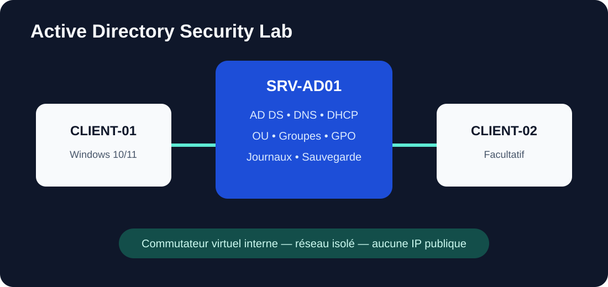

# Active Directory Security Lab

Laboratoire pédagogique consacré au déploiement et au durcissement d'un domaine Active Directory dans un réseau virtuel isolé. Ce dépôt prépare l'architecture, les procédures et la recette ; il ne présente pas le laboratoire comme terminé tant que les preuves réelles n'ont pas été ajoutées.

## Objectif

- comprendre le rôle d'AD DS, DNS et DHCP ;
- structurer les utilisateurs, groupes et unités d'organisation ;
- appliquer des GPO de sécurité mesurées ;
- gérer les droits selon le moindre privilège ;
- journaliser les événements importants ;
- préparer une sauvegarde et une restauration testable ;
- produire des preuves techniques reproductibles.

## Architecture

| Machine | Système | Rôle prévu |
|---|---|---|
| `SRV-AD01` | Windows Server | AD DS, DNS, DHCP, GPO et journalisation |
| `CLIENT-01` | Windows 10/11 | poste membre et validation utilisateur |
| `CLIENT-02` | Windows 10/11 | poste facultatif pour tests croisés |

Le réseau utilise uniquement un commutateur virtuel interne, sans exposition directe à Internet. Les adresses définitives seront documentées après création du laboratoire.

## Environnement technique

- hyperviseur local : `TODO: à préciser après réalisation du lab.`
- version de Windows Server : `TODO: à compléter après réalisation du lab.`
- versions des clients Windows : `TODO: à compléter après réalisation du lab.`
- nom de domaine de laboratoire : `TODO: à définir sans reprendre un domaine public réel.`
- PowerShell et consoles Microsoft natives.

## Prérequis

- ordinateur disposant des ressources nécessaires à deux ou trois VM ;
- images Windows obtenues légalement ;
- réseau virtuel isolé ;
- snapshots avant les étapes sensibles ;
- comptes d'administration distincts des comptes utilisateurs ;
- aucun secret enregistré dans Git.

## Mise en place

1. Créer le réseau virtuel isolé et les VM.
2. Configurer le nom, l'heure et l'adressage privé de `SRV-AD01`.
3. Installer AD DS et créer une nouvelle forêt de laboratoire.
4. Vérifier DNS, puis installer et autoriser DHCP.
5. Créer les OU, utilisateurs et groupes à partir des matrices fournies.
6. Joindre les postes clients au domaine.
7. Créer et lier les GPO après sauvegarde de leur configuration.
8. Configurer la journalisation et la sauvegarde.
9. Exécuter le plan de recette.

`TODO: à compléter après réalisation du lab avec les commandes réellement utilisées.`

## Tests réalisés

| Test | Résultat attendu | État |
|---|---|---|
| résolution DNS du domaine | réponse du DNS AD | TODO |
| attribution DHCP | bail reçu dans la plage prévue | TODO |
| jonction d'un client | ordinateur visible dans la bonne OU | TODO |
| ouverture de session utilisateur | authentification réussie | TODO |
| application GPO | stratégie visible avec `gpresult` | TODO |
| accès non autorisé | refus conforme à la matrice | TODO |
| événement de sécurité | trace exploitable dans l'observateur | TODO |
| restauration | objet ou fichier restauré et contrôlé | TODO |

## Sécurité mise en œuvre

- réseau isolé et absence d'adresse publique ;
- comptes d'usage courant séparés des comptes d'administration ;
- groupes de sécurité plutôt que droits attribués directement ;
- délégations limitées aux OU nécessaires ;
- politique de mots de passe adaptée au laboratoire ;
- verrouillage progressif après échecs répétés ;
- GPO testées sur une OU pilote avant généralisation ;
- journalisation des authentifications et changements sensibles ;
- sauvegarde documentée et restauration à valider.

`TODO: confirmer chaque mesure par une preuve après réalisation du lab.`

## Résultats

`TODO: à compléter après réalisation du lab. Aucun résultat n'est revendiqué à ce stade.`

## Compétences développées

AD DS, DNS, DHCP, OU, groupes, GPO, droits NTFS, authentification, journalisation, sauvegarde, recette et documentation technique.

## Captures d'écran

Les captures seront déposées dans `evidence/` après anonymisation. Voir les règles de preuve du dossier.

`TODO: ajouter uniquement des captures réelles, datées et sans secret.`

## Difficultés rencontrées

`TODO: documenter les incidents réellement rencontrés et leur diagnostic.`

## Axes d'amélioration

- ajouter un second contrôleur de domaine ;
- intégrer Windows LAPS ;
- centraliser les événements dans un SIEM ;
- mesurer les écarts avec un outil d'audit AD ;
- tester un scénario de restauration isolée.

Ces axes sont des propositions et ne sont pas présentés comme déjà réalisés.

